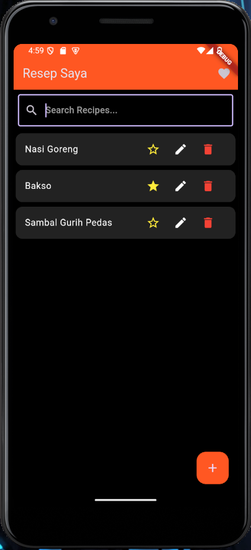
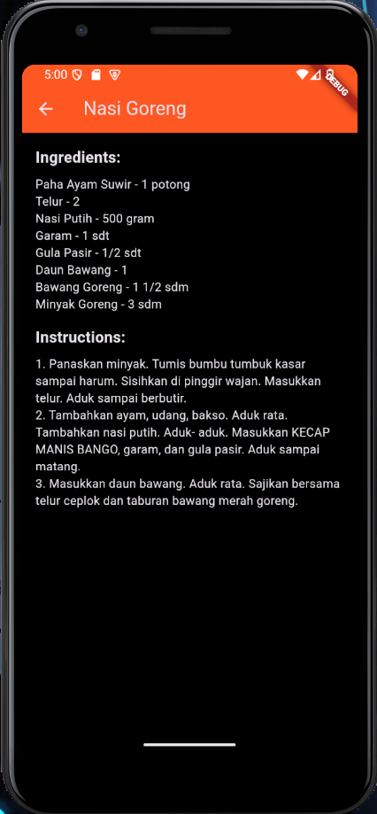
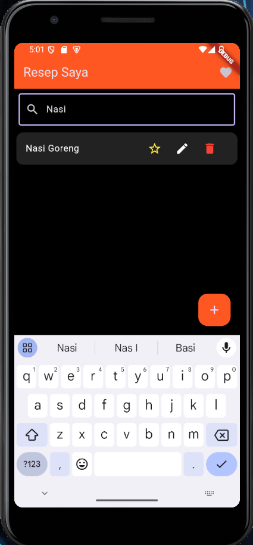
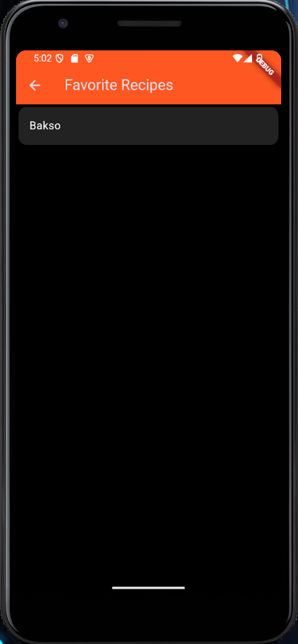
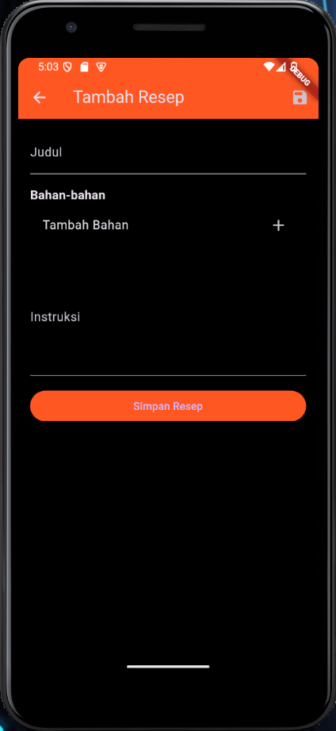
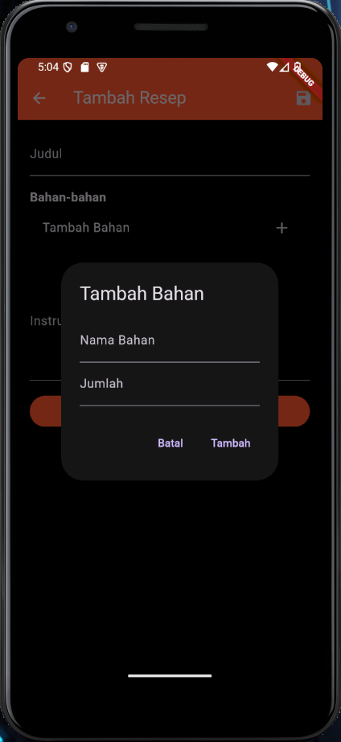
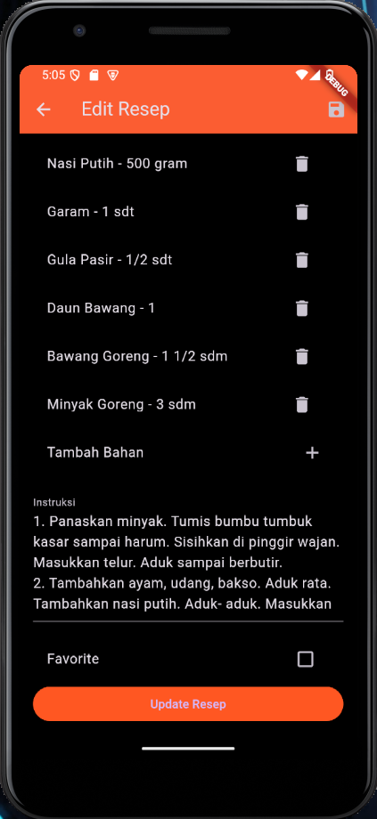
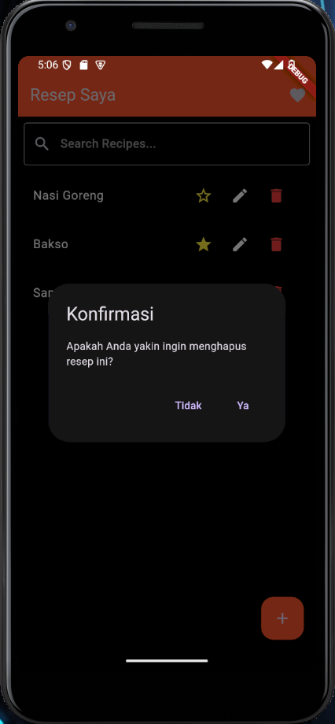

# Recipe Notes App

Aplikasi Recipe Notes adalah sebuah aplikasi untuk menyimpan dan mengelola resep masakan. Aplikasi ini dikembangkan sebagai tugas besar mata kuliah Praktikum Pemrograman Mobile kelompok 4, Universitas Institut Teknologi Garut.

## Anggota Kelompok

- Ade Kurnia      (2106029) - [GitHub](https://github.com/adekurgntng)
- Tiara Febrianti (2106061) - [GitHub](https://github.com/tiarafbrnti)
- Nadia Fitriani  (2106132) - [GitHub](https://github.com/nadiafitriani)

## Deskripsi Proyek

Proyek ini bertujuan untuk memudahkan pengguna dalam menambah, melihat, mengedit, dan menghapus resep masakan. Aplikasi menggunakan API lokal XAMPP sebagai backend untuk penyimpanan data resep.

Fitur aplikasi ini meliputi:
- Menambahkan resep baru dengan judul, bahan-bahan, dan instruksi.
- Menampilkan daftar resep dan detail resep secara terperinci.
- Mengedit dan menghapus resep yang sudah ada.
- Menandai resep sebagai favorit.
- Fitur pencarian untuk mencari resep berdasarkan nama resep.

## Teknologi yang Digunakan

- Flutter untuk pengembangan aplikasi mobile cross-platform.
- Dart sebagai bahasa pemrograman utama.
- PHP untuk API backend.
- XAMPP sebagai server lokal untuk menyimpan dan mengelola data resep menggunakan MySQL.

## Dependencies

Berikut adalah daftar dependensi yang digunakan dalam proyek ini:

- **http**: Untuk melakukan permintaan HTTP ke server backend.
- **shared_preferences**: Untuk menyimpan data favorit resep secara lokal di perangkat pengguna.

## Tangkapan Layar

**Daftar Resep**  

**Detail Resep**  

**Cari Resep Berdasarkan Nama Resep**  

**Favorit Resep**  

**Tambah Resep**  

**Tambah Bahan**  

**Edit Resep**  

**Hapus Resep**  

## Kontribusi

Kami menyambut kontribusi dari para pengembang untuk meningkatkan aplikasi ini. Jika Anda ingin berkontribusi, silakan fork repository ini dan buat pull request dengan perubahan Anda.

---
© 2024 Ade Kurnia, Tiara Febrianti, Nadia Fitriani. Dibuat dengan 💙 di Universitas Institut Teknologi Garut.
